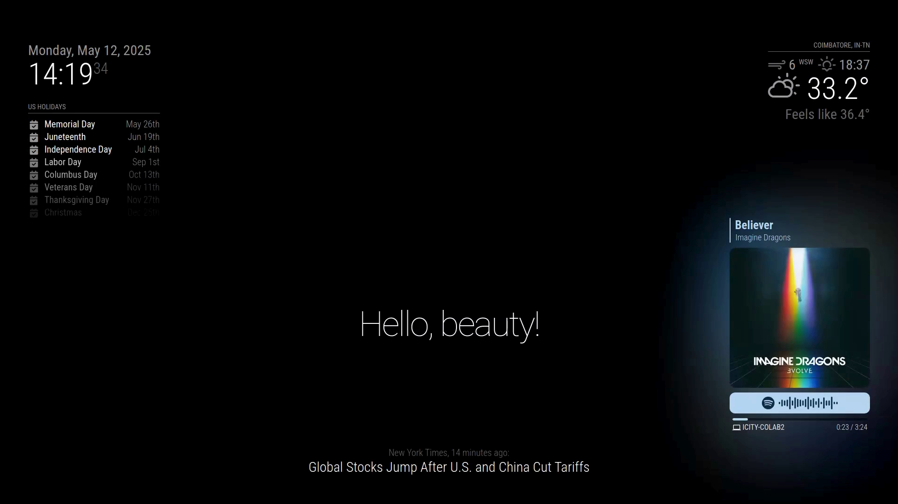

# 🪞 Smart Mirror Project

This is a customized **MagicMirror²** setup that transforms a regular monitor and Raspberry Pi (or any compatible system) into a **smart home dashboard**. It includes modules for weather updates, news, calendar, compliments, Spotify, and even optional voice command support.

---

## 🛠️ Features

- 📅 **US Holiday Calendar** Integration  
- 🕒 **Digital Clock**  
- 🌦️ **Current Weather** (via OpenMeteo)  
- 📰 **Live News Feed** (New York Times)  
- 💬 **Daily Compliments**  
- 🔔 **Update Notifications**  
- 📺 **Screencast Support**  
- 🎶 **Spotify Integration**  
- 🗣️ **Voice Control** (optional)

---

## 📁 Project Structure

- `config/config.js`: Main configuration file defining all modules and their setup  
- `modules/`: Contains built-in and 3rd-party MagicMirror modules  

---

## 📦 Prerequisites

- Node.js & npm  
- A Raspberry Pi / Linux-based system  
- [MagicMirror²](https://magicmirror.builders)  
- Internet connection for external APIs  
- Spotify developer credentials (for Spotify module)

---

## 🔧 Installation

1. **Clone the MagicMirror repository and install dependencies:**

   ```bash
   git clone https://github.com/MichMich/MagicMirror
   cd MagicMirror
   npm install
   ```

2. **Replace the default config with your custom config file:**

   ```bash
   cd config
   cp YOUR_CUSTOM_config.js config.js
   ```

3. **Install additional 3rd-party modules if necessary:**

   ```bash
   cd ../modules
   git clone https://github.com/[MODULE_REPO] [MODULE_NAME]
   ```

4. **Start the MagicMirror application:**

   ```bash
   npm run start
   ```

---

## 🌦️ Weather Configuration

Using [Open-Meteo](https://open-meteo.com) API:

```js
lat: 11.031835,
lon: 76.910519
```

Update these values in `config.js` to match your location. You can get your coordinates from [latlong.net](https://www.latlong.net/).

---

## 📰 News Feed

News feed is set to pull from **The New York Times**:

```js
url: "https://rss.nytimes.com/services/xml/rss/nyt/HomePage.xml"
```

You can replace it with any other RSS feed URL of your choice.

---

## 🎶 Spotify Integration

This project uses the `MMM-OnSpotify` module to display and control Spotify playback.

### Required Credentials

You need a [Spotify Developer Account](https://developer.spotify.com/dashboard/) to generate:

- `clientID`
- `clientSecret`
- `accessToken`
- `refreshToken`

### Example configuration:

```js
module: "MMM-OnSpotify",
position: "bottom_right",
config: {
  clientID: "<YOUR_CLIENT_ID>",
  clientSecret: "<YOUR_CLIENT_SECRET>",
  accessToken: "<YOUR_ACCESS_TOKEN>",
  refreshToken: "<YOUR_REFRESH_TOKEN>"
}
```

> ⚠️ Do not commit actual credentials to a public repository.

---

## 🗣️ Optional: Voice Control

Voice control is available through modules like `MMM-Voice-Control` or `MMM-VoiceControl`.

### Example configuration (commented in `config.js`):

```js
module: "MMM-VoiceControl",
config: {
  accessKey: "<YOUR_PICOVOICE_ACCESS_KEY>",
  microphone: {
    recordProgram: "arecord",
    device: "plughw:3,0"
  },
  recognition: {
    engine: "rhino",
    context: "rhino_contexts/MagicMirror_en_raspberry-pi_v3_0_0.rhn",
    sensitivity: 0.6
  },
  commands: {
    "wake up": {
      moduleExec: {
        module: "MMM-Remote-Control",
        exec: "monitorOn"
      }
    },
    "go to sleep": {
      moduleExec: {
        module: "MMM-Remote-Control",
        exec: "monitorOff"
      }
    },
    "show weather": {
      moduleExec: {
        module: "weather",
        exec: "show"
      }
    },
    "hide calendar": {
      moduleExec: {
        module: "calendar",
        exec: "hide"
      }
    }
  },
  debug: true
}
```

### Optional Commands Supported

- "wake up" → Turn monitor on  
- "go to sleep" → Turn monitor off  
- "show/hide calendar"  
- "show/hide weather"  

---

## 🔐 Security Note

- Never publish your `clientSecret`, `accessToken`, or other private keys in a public repository.  
- Use environment variables or a `.env` file to store private data safely.  

---

## 📷 Screenshots




---

## 🙌 Acknowledgements

- [MagicMirror²](https://magicmirror.builders)  
- [Open-Meteo API](https://open-meteo.com)  
- [New York Times RSS](https://rss.nytimes.com/)  
- [Spotify Developer](https://developer.spotify.com)  
- [Picovoice](https://picovoice.ai/)


